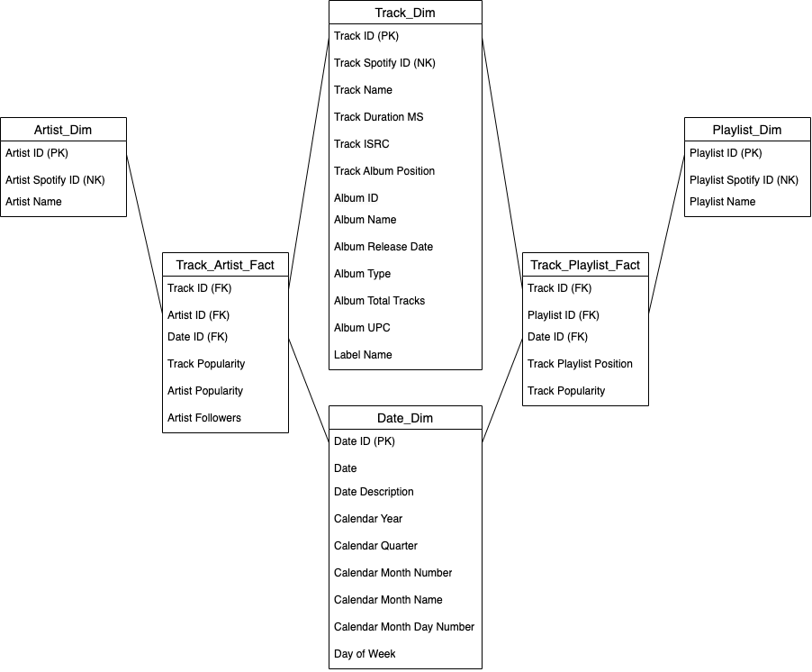

# Music Data Warehouse

### Background

The end goal of this project was to create a business intelligence tool capable of identifying big-picture streaming trends 
in recording artists' careers and playlists in general. 

To accomplish this, I first had to build the data infrastructure
needed to track a large volume of releases and artists. Ultimately I opted to set up a data warehouse to store track/artist metadata 
that would be extracted from Spotify playlists. After studying the Spotify Web API documentation to discern which information 
could eventually be useful, I began this project by designing a dimensional model for the data warehouse (see the diagram below). 
<br>
<br>



I then created two main scripts ('spot_api.py' & 'spot_dw.py') to extract playlist metadata and store that information in the 
data warehouse. I also utilized Airflow to ingest playlist data on a regular schedule.

Lastly, I developed the 'playlist_tracker' web app that connects to the data warehouse and can be used to identify rising tracks and artists. 

### API Documentation

[Spotify Web API](https://developer.spotify.com/documentation/web-api)

### Prerequisites

To interact with the Spotify Web API, you'll first need to obtain a 'Client ID' and 'Client Secret' [here](https://developer.spotify.com/documentation/web-api/tutorials/getting-started).

I also used the following tools and technologies in this project...

- Docker / Docker Desktop
- Airflow
- DBeaver
- Postgres
- Django
- Bootstrap

### Usage

The major components of this project all run in their own docker container. One can execute the command below in their own terminal to get 
everything up and running. The 'playlist_tracker' web app can be accessed on port 8080.

  ```sh
  docker-compose up -d
  ```

In its current state, 'playlist_tracker' has two main pages that summarize different aspects of the information stored 
in the data warehouse's tables. 

*Releases*
- Here, one can search for any track in the data warehouse that has been released by a record label of interest
- After making a selection, one can gain insight into both the track and its artist's performance metrics over time

*Placements*
- This page provides an overview of the labels responsible for placing the tracks on a particular playlist
- A user can adjust the filters to view this information for a specific date or a larger time period

Finally, one also has the ability to track a new playlist from any one of the web app's pages.

